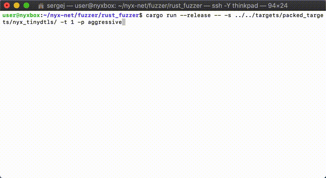

# Nyx Spec-Fuzzer

Nyx Spec-Fuzzer is one fuzzing frontend building on Nyx's Snapshot capabilities. It features the ability to fuzz complex interactive sequences of actions, such as netowork packets, hypercalls, syscalls, api-calls or gui interactions, by expressing them in a specification. The specification describes a set of functions with affine types (e.g. very similar to rust functions). The fuzzer chains & combinaes those functions to obtain sequences of validly typed function calls. The spec compiles to a simple header-only bytecode interpreter that can be used to execute the fuzzing inputs. All you need to do is to fill in the function definitions with your concrete semantics. This format also allows this fuzzer to make use of incremental snapshots to speed up fuzzing.

More details can be found in our papers.

<p>

</p>

## Usage

Getting this fuzzer running is quite simple: run `./setup.sh`, move to the `rust_fuzzer/` folder and run `cargo run --release -- -h` to get the following describtion on all available parameters:

```
Fuzz EVERYTHING!

USAGE:
    rust_fuzzer [FLAGS] [OPTIONS]

FLAGS:
        --exit_after_first_crash    terminate fuzzing after the first crash was found
    -h, --help                      Prints help information
    -V, --version                   Prints version information

OPTIONS:
    -c, --cpu <CPU_START>                   overrides the config value for the first CPU to pin threads to
        --seed <SEED>                       runs the fuzzer with a specific seed, if not give, a seed is generated from
                                            a secure prng
    -s, --sharedir <SHAREDIR_PATH>          path to the sharedir
    -p, --placement <SNAPSHOT_PLACEMENT>    overrides the config value for snapshot placement strategy (options:
                                            aggressive / balanced)
    -t, --threads <THREADS>                 overrides the config value for the number of parallel fuzzing threads to run
    -w, --workdir <WORKDIR_PATH>            overrides the workdir path in the config
```

This fuzzer expects the target to be converted to a so-called "sharedir" format. This can be done by using the packer tool provided by the Nyx framework to convert your target application into this specific format. 

Moreover, there is also a debugger available to run single executions by providing the specific payload. You can find this tool in `rust_fuzzer_debug/`.

 <a>  </a>

## Bug Reports and Contributions

If you found and fixed a bug on your own: We are very open to patches, please create a pull request!  

### License

This tool is provided under **AGPL license**. 

**Free Software Hell Yeah!** 

Proudly provided by: 
* [Sergej Schumilo](http://schumilo.de) - sergej@schumilo.de / [@ms_s3c](https://twitter.com/ms_s3c)
* [Cornelius Aschermann](https://hexgolems.com) - cornelius@hexgolems.com / [@is_eqv](https://twitter.com/is_eqv)
